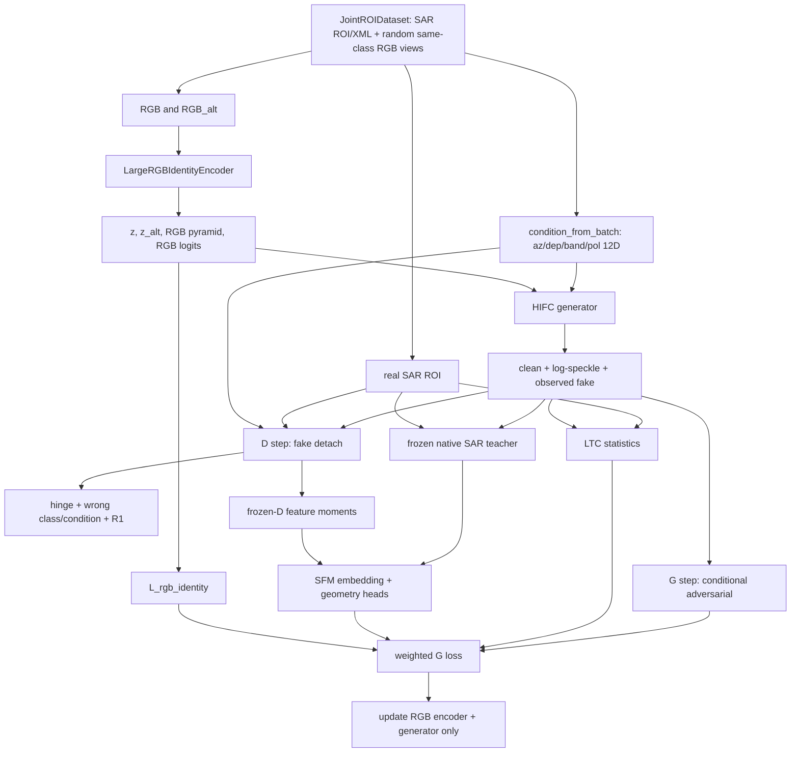

# HiFC 风格无像素配对 RGB→SAR 实验

## 1. 结论与边界

HiFC-GAN 的论文公开页面在 [AAAI](https://ojs.aaai.org/index.php/AAAI/article/view/38342)。当前没有找到作者公开的官方代码仓库，因此本项目没有伪装成“下载并原样复现”，而是把论文中最适合本数据的两条主线重新实现：

- **LTC（Local Texture Contrast）**：浅层局部纹理/对比度约束。
- **SFM（Semantic Feature Mapping）**：深层 SAR 语义特征映射。

本实现是新的独立实验 `hifc_unpaired_conditioned_v1`，不会覆盖或修改已经验证的 V1/MT1。它解决的是数据接口问题：RGB 是车辆侧视图，SAR 是独立采集的 ROI，不能使用 RGB 与 SAR 的同坐标像素重建或 cycle consistency。

重要限制：这是一个可运行的 HiFC-inspired 基线，不代表分类器捷径已经被证明消除。最终仍必须用“生成 X/HH 训练独立 CNN、真实 X/HH 测试”（TSTR）判断真实信息是否迁移。

## 2. 数据与采样

默认数据目录：

```text
/data/newdata/A25_T37_down_大图/A02/RGB
/data/newdata/A25_T37_down_大图/A02/SOC_40classes_cut/train
/data/newdata/A25_T37_down_大图/A02/SOC_40classes_cut/test
```

训练入口：`train_hifc_unpaired_sar_gan.py`。

`JointROIDataset` 已经可以读取 TIFF/XML/RGB。全条件扫描结果为 68,091 个训练 TIFF：

| 维度 | 取值 |
| --- | --- |
| 车型 | 40 类 |
| 波段 | X、KU |
| 极化 | HH、HV、VH、VV |
| 俯仰角 | 15、30、45、60 |
| 方位角 | XML 中的 0–359 度 |

默认训练使用 `--band all --polarization all --depression all`，这样网络才有机会学习波段和极化。只想做原来的 X/HH 对照时使用 `--band X --polarization HH`；此时波段和极化是常量，不能从数据中学习对应变化。

每个样本的关系是：

1. 从一个 SAR TIFF/XML 记录得到真实 SAR ROI、车型标签和目标采集条件。
2. 从**同车型**的 RGB 文件夹中随机抽取一个源视角，再抽取另一个独立视角作为 `rgb_alt`。
3. RGB 与 SAR 只按车型建立弱语义关系；不要求同一个实例、同一个视角或同一坐标。
4. RGB 的原始视角角度、SAR bbox 宽高不送入目标条件，避免网络使用不可靠的 shortcut。

因此训练属于 **class-matched unpaired**，而不是 pix2pix paired。

## 3. 条件向量

`condition_from_batch()` 输出固定 12 维，顺序不能改变：

```text
[azimuth_sin, azimuth_cos,
 dep_15, dep_30, dep_45, dep_60,
 band_X, band_KU,
 pol_HH, pol_HV, pol_VH, pol_VV]
```

条件只描述目标 SAR 采集方式。`band_X` 在原始 metadata 中是 1，转换成 `[band_X, band_KU]`；native classifier 的 band target 仍采用训练脚本约定的 `X=0, KU=1`。

方位角用 sin/cos 表示，避免 0/360 度断点；监督用 `((azimuth+15)%360)//30` 转成 12 个 azimuth bins。俯仰、波段、极化使用 one-hot。

## 4. 模型架构

### 4.1 RGB 身份编码器

类：`LargeRGBIdentityEncoder`（来自 `dual_component_sar_gan.py`）。

- 输入：`RGB [B,3,128,128]`。
- 四个 stride-2 stage：通道 `64→128→256→512`，输出空间 `64/32/16/8`。
- Adaptive average pooling + Linear 得到 `identity z [B,512]`。
- 同时输出 40 类 RGB logits 和四层 RGB pyramid。
- 两个随机源视角共享参数，`rgb_alt` 只用于身份/视角不变性。

### 4.2 一阶段 SAR 生成器

类：`HIFCUnpairedGenerator`（继承 `OneStageWaveletSARGenerator`）。

```text
z(512) + condition(12)
        ↓ Linear condition → 256
        ↓ FC → 512×4×4
        ↓ 4 个 bilinear + Blur2d + SPADE-like RGB modulation block
        ↓ 64×64 feature
        ├─ clean_head → clean reflectivity [B,1,64,64], tanh
        └─ noise_features → heteroscedastic log-speckle
clean × exp(log-speckle) → observed SAR [B,1,64,64]
```

生成器的输出是 `(clean, log_noise, observed, feature)`。LTC、SFM 和判别器都主要看 `observed`；`clean` 只用于预览和后续可选的反射率分析。它没有 RGB→SAR 像素重建头。

### 4.3 共享条件判别器

类：`HIFCConditionedDiscriminator`，内部是一个 `ProjectionPatchDiscriminator`，不是三个相互独立的 critic。

- 输入：SAR 图像、40 类 `class_id`、12 维目标条件。
- SN Conv 通道为 `64/128/256/512`，输出一个 batch scalar 和最后一层 feature map `[B,512,4,4]`。
- class embedding 与 geometry MLP 做 projection score。
- 真实图像的错误车型、错误条件分别作为负样本，防止 D 只判断“是不是 SAR”而忽略类别和采集条件。

判别器没有把源 RGB 角度输入进去，也没有单独的 K+1 fake-class head。真/假、车型、波段、极化、俯仰和方位条件都由同一个条件 projection critic 处理。

### 4.4 Frozen native SAR teacher

类：`SARClassifier64`，checkpoint：

```text
code/server_results/sar_native64_multitask_v1/best.pt
```

它只接收一通道 SAR 强度图，不接收 metadata。主干输出 384 维 embedding，并有四个辅助头：

```text
band: 2, polarization: 4, depression: 4, azimuth: 12
```

训练 HiFC 时 teacher 参数始终冻结，但对生成图像输入保留梯度；真实图像 feature 使用 `detach/no_grad`。teacher 的硬 class CE **没有**放进这个新基线，避免直接奖励旧分类器捷径；它的 pre-classifier embedding 用于 SFM，四个 metadata head 用于几何辅助。

## 5. 五个 loss 与梯度路径

默认权重来自脚本参数：

```text
rgb_identity_weight = 1.0
ltc_weight          = 2.0
sfm_weight          = 2.0
geometry_weight     = 0.30
adversarial_weight  = 1.0（第 1 个 warmup epoch 为 0）
```

### 5.1 `L_rgb_identity`

代码：`rgb_identity_loss()`。

```text
0.5 * CE(rgb_logits, class)
+ 0.5 * CE(alt_logits, class)
+ 0.5 * (1 - cosine(z, z_alt))
```

它只更新 RGB encoder（以及通过 encoder 输出影响 G 的路径），不比较 SAR 像素。两个视角共享车型语义，防止 encoder 把一个 RGB 视角的纹理当成唯一身份。

### 5.2 `L_adv`

代码：训练脚本中的 `adversarial = -D(fake, class, condition).mean()`。

G 让生成观测图在指定车型和指定采集条件下通过同一个条件 D。第一个 epoch 默认 warmup，不使用该项；之后权重为 1。

### 5.3 `L_ltc`

代码：`local_texture_signature()` 和 `local_texture_contrast_loss()`。

对每张图计算以下局部量，再只比较 batch 的 mean/std：

```text
residual3  = amplitude - AvgPool3(amplitude)
residual7  = amplitude - AvgPool7(amplitude)
contrast3  = residual3 / (AvgPool3(amplitude)+0.04)
contrast7  = residual7 / (AvgPool7(amplitude)+0.04)
haar       = observable Haar detail energy
```

每个量只取 `mean/std/abs-mean`，fake 与 real 的统计签名用 SmoothL1 比较。没有任何 `fake[...,y,x] - real[...,y,x]`，没有 `_align_translation`，所以它是无像素配对版本的 LTC。

### 5.4 `L_sfm`

代码：`semantic_feature_mapping_loss()`。

```text
cosine = 1 - mean(cos(normalize(fake_teacher_feature),
                       normalize(real_teacher_feature)))
batch_mean = SmoothL1(fake_feature_mean, real_feature_mean)
feature_moment = D_feature_mean/std 与 real D_feature_mean/std 的 SmoothL1
L_sfm = cosine + 0.5*batch_mean + 0.5*feature_moment
```

这是 global/deep feature 约束，不是像素约束。真实 teacher feature 和真实 D feature 都 detach。它不使用 teacher class CE，因此比直接把 fake 推到 native class logit 更不容易形成纯分类器捷径；但 teacher 仍是一个监督来源，必须用 TSTR 复核。

### 5.5 `L_geometry`

代码：`geometry_auxiliary_loss()`。

```text
L_geometry = 0.25 * (
  CE(native.band_head(fake), band) +
  CE(native.polarization_head(fake), polarization) +
  CE(native.depression_head(fake), depression) +
  CE(native.azimuth_head(fake), azimuth_bin))
```

它只约束 SAR 的波段、极化、俯仰和方位信息，不加入 40 类 hard class CE。目标标签来自 XML 文件名/metadata，不喂给 teacher。

### 5.6 判别器 loss

代码：`discriminator_hinge()` 和训练循环。

```text
L_D = hinge(D(real,c), D(fake.detach(),c))
    + 0.25 * mean(ReLU(1 + D(real, wrong_class, c)))
    + 0.25 * mean(ReLU(1 + D(real, class, wrong_condition)))
    + lazy R1
```

wrong condition 使用 batch rotation；当前 smoke 默认 `r1_weight=.25`、每 16 个 batch 触发一次并按间隔校正。D 步只看 `fake.detach()`，不把 D 梯度回传到 G。

## 6. 每个训练 batch 的精确流程



实际梯度归属：

| 模块 | `L_rgb` | `L_adv` | `L_ltc` | `L_sfm` | `L_geometry` | `L_D` |
| --- | --- | --- | --- | --- | --- | --- |
| RGB encoder | 是 | 间接 | 否 | 间接（经 G 输入） | 间接（经 G 输入） | 否 |
| generator | 否/仅经 encoder 路径 | 是 | 是 | 是 | 是 | 否 |
| native teacher | 冻结 | 冻结 | 不涉及 | 参数冻结、输入可导 | 参数冻结、输入可导 | 不涉及 |
| discriminator | 冻结 | 输入梯度可用、参数冻结 | 不涉及 | feature 用于统计、参数冻结 | 不涉及 | 是 |

## 7. 与原 v1 的明确区别

| 项目 | 原 continuous-spatial V1/MT1 | HiFC unpaired v1 |
| --- | --- | --- |
| RGB/SAR 关系 | 同车型弱配对，部分路径仍可做平移对齐 | 同车型随机 RGB，显式无像素配对 |
| 条件 | 12D metadata + RGB 源角度，D 只看部分 target 条件 | 12D 只含 target az/dep/band/pol，源角度和 bbox 去除 |
| RGB encoder | `RGBIdentityEncoder`，V1 两个身份项/后续 MT1 | `LargeRGBIdentityEncoder`，身份 CE 与视角 cosine 合并成一个 loss |
| 生成器 | `SpatialROIGenerator` 或历史 V1 generator | 一阶段 wavelet/SPADE-like clean + learned speckle |
| 判别器 | V1 PatchGAN；Fused V2 另有 K+1 classifier-D（历史失败） | 一个共享 conditional projection PatchGAN |
| 局部纹理 | statistics/structure/physics/feature match 多项 | LTC：局部 residual、contrast、Haar 的统计签名 |
| 深层语义 | native class CE、cluster、MT1 等多条路径 | native pre-classifier embedding SFM + D feature moments |
| 几何 | angle loss、native geometry 可选 | band/pol/dep/az 四个 frozen teacher auxiliary heads |
| 像素级项 | V1 仍有 pixel64/32/16、弱 translation alignment | 完全没有 RGB-SAR pixel L1，也不调用 `_align_translation` |
| 物理项 | physics prior、spectrum、equivariance 等 | 当前基线不使用；先隔离 HiFC 两条主线 |
| 评估 | V1 visual gates、native teacher accuracy、MT1 TSTR | 同样必须增加独立 TSTR；native accuracy 只做诊断 |

## 8. 运行方式

先做 X/HH 小规模试跑：

```bash
cd /data/newdata/A25_T37_down_大图/code
python -u train_hifc_unpaired_sar_gan.py \
  --rgb-root /data/newdata/A25_T37_down_大图/A02/RGB \
  --sar-train-root /data/newdata/A25_T37_down_大图/A02/SOC_40classes_cut/train \
  --native-classifier-checkpoint server_results/sar_native64_multitask_v1/best.pt \
  --output runs/hifc_unpaired_xhh \
  --band X --polarization HH --depression all \
  --epochs 120 --epoch-size 24000 --batch-size 16 --workers 4 --device cuda:0
```

推荐的正式条件学习入口：

```bash
cd /data/newdata/A25_T37_down_大图/code
DATA_ROOT=/data/newdata/A25_T37_down_大图/A02 \
DEVICE=cuda:0 OUTPUT=runs/hifc_unpaired_all_conditions \
bash run_hifc_unpaired_all.sh
```

渲染一个车型在 X/HH、俯仰 30 度下的 12 个方位：

```bash
python render_hifc_unpaired_sar.py \
  --gan-checkpoint runs/hifc_unpaired_all_conditions/latest.pt \
  --rgb-root /data/newdata/A25_T37_down_大图/A02/RGB \
  --class-name Buick_GL8 --source-angle 0 \
  --depression 30 --band X --polarization HH \
  --output runs/hifc_unpaired_all_conditions/Buick_GL8_azimuth_sweep.png \
  --device cuda:0
```

输出文件：

```text
config.json       # 条件布局、权重、数据过滤器、无像素声明
history.csv       # 五项 G loss、D loss、native geometry 诊断
latest.pt         # 当前 checkpoint
epoch_*.pt        # 每 10 epoch checkpoint
validation_*.png  # RGB / real SAR / clean / observed fake
```

## 9. 当前 smoke 结果与下一步判据

已完成一批 GPU smoke（全条件、epoch 1、train 1 batch、validation 1 batch）：

```text
train records: 57881
validation records: 10210
trainable parameters: 24069164
checkpoint: runs/hifc_unpaired_smoke/latest.pt
preview:    runs/hifc_unpaired_smoke/validation_001.png
```

这是代码和梯度路径检查，不是效果结论。正式实验必须：

1. 固定 seed 和 split，先比较 `all-condition` 与 X/HH 对照。
2. 用独立 classifier 在**生成 X/HH 原图训练、真实 X/HH 原图测试**，报告 Top-1、Top-5 和四个 depression 分层结果。
3. 报告 azimuth sweep 的 Δ5、Δ30、0/360 闭环；报告 native geometry 只作诊断，不把 100% class accuracy 当作成功。
4. 与 V1/MT1 使用同一 TSTR classifier seed、同一真实测试集，避免把数据切分差异误判成改进。

