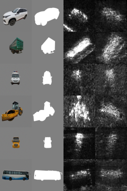
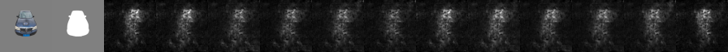

# UNSB-SAR full experiment report

日期：2026-09-05  
输出目录（本地）：`/data/newdata/A25_T37_down_大图/code/runs/unsb_sar_bridge_full_fast_20260905/`  
TSTR 输出目录（本地）：`/data/newdata/A25_T37_down_大图/code/runs/unsb_tstr_xhh_20260905/`

## 1. 实验目的

验证无像素配对 RGB -> SAR 的 bridge/diffusion-style 路线是否能同时保留车辆类别和
SAR 成像条件，而不仅仅是生成 SAR 外观。生成器训练不读取真实 test 像素；TSTR 使用
生成 X/HH 训练独立的 `SARClassifier64`，然后只在真实 X/HH test 上评估。

## 2. 训练配置

- 类别：40
- 波段：all（X、KU 等）
- 极化：all（HH、HV、VH、VV）
- 俯视角：15/30/45/60 度
- SAR ROI：64x64，RGB 输入视图：原始车辆参考图，数据接口内部做 ROI 预处理
- global batch：64（8 GPU）
- epoch size：24,000 samples
- epoch：120
- bridge steps：epoch 1-7 为 5，epoch 8-120 为 3（缓存条件和第一条 trajectory）
- EMA：0.999
- 固定 seed：20260905
- 主要权重：`lambda_gan=1.0`、`lambda_sb=0.1`、`lambda_nce=1.0`

完整参数在 [`generator_config.json`](generator_config.json)，逐 epoch 曲线在
[`generator_history.csv`](generator_history.csv)。

## 3. 模型和 loss

输入被拆成 silhouette/source endpoint、RGB identity token 和 acquisition condition。
geometry 在 64/32/16/8 尺度注入 bridge U-Net；条件判别器和 energy model 约束 SAR
目标域，PatchNCE 约束前景/边界内容，SB 项约束 source-to-target 的逐步传输。训练总
生成器目标为：

```text
L_G = 1.0 * L_adv + 0.1 * L_SB + 1.0 * L_NCE
```

另外记录 RGB identity/view consistency 作为诊断项；没有 native SAR classifier 对
生成器反传、没有 RGB-SAR 像素对齐、没有 cycle loss，也没有把 class one-hot 直接
旁路给生成器。详细的张量尺寸和反传路径见 [`code/UNSB_SAR_BRIDGE.md`](../../code/UNSB_SAR_BRIDGE.md)。

## 4. 最终 loss 记录

`history.csv` 最后一行（epoch 120）：

| 项目 | 值 |
| --- | ---: |
| g_total | 2.79645 |
| g_adv | 0.86868 |
| g_sb | 0.01480 |
| g_nce | 1.92619 |
| identity | 0.00104 |
| d_loss | 1.99013 |
| e_loss | 0.01480 |
| RGB identity accuracy | 100% |

## 5. TSTR 结果

`train_generated_sar_classifier_unsb.py` 使用 classifier seed 415、30 epochs。生成训练
集上的 Top-1 最终为 99.88%，但这不是泛化指标；真实 X/HH test（5260 ROI）为：

| 指标 | epoch 30 最终值 |
| --- | ---: |
| class Top-1 | 15.93% |
| class Top-5 | 38.95% |
| azimuth Top-1 | 17.32% |
| azimuth circular MAE | 89.61° |

按俯视角的 class Top-1：15° 15.77%、30° 19.73%、45° 17.28%、60° 11.04%。
12-bin 方位随机 Top-1 是 8.33%，随机 circular MAE 约 90°，因此方位学习接近随机。

此前 HiFC 全量 baseline 的三 seed TSTR 约为 Top-1 48.32%、Top-5 74.42%；本实验明显
更低。结论是：该版本的视觉域迁移有一定效果，但车辆身份和角度的跨域可迁移性不足，
不能把 RGB identity accuracy=100% 当成 SAR 信息已经学到的证据。

## 6. 可视化





预览能看到 SAR-like speckle/亮斑和条带，但 angle sweep 在固定噪声下变化很小，且有
明显的垂直亮带。它支持“纹理先学到、几何/方位后验不足”的判断。

## 7. 复现与权重

权重没有提交到 GitHub：`epoch_120.pt` 约 414 MB，且 GitHub 单文件限制会妨碍正常
clone。原始权重仍在训练服务器的上述本地目录；下载后按根目录 README 的命令运行。
上传的 CSV、JSON 和 PNG 已足以检查配置、曲线和可视化结果。

