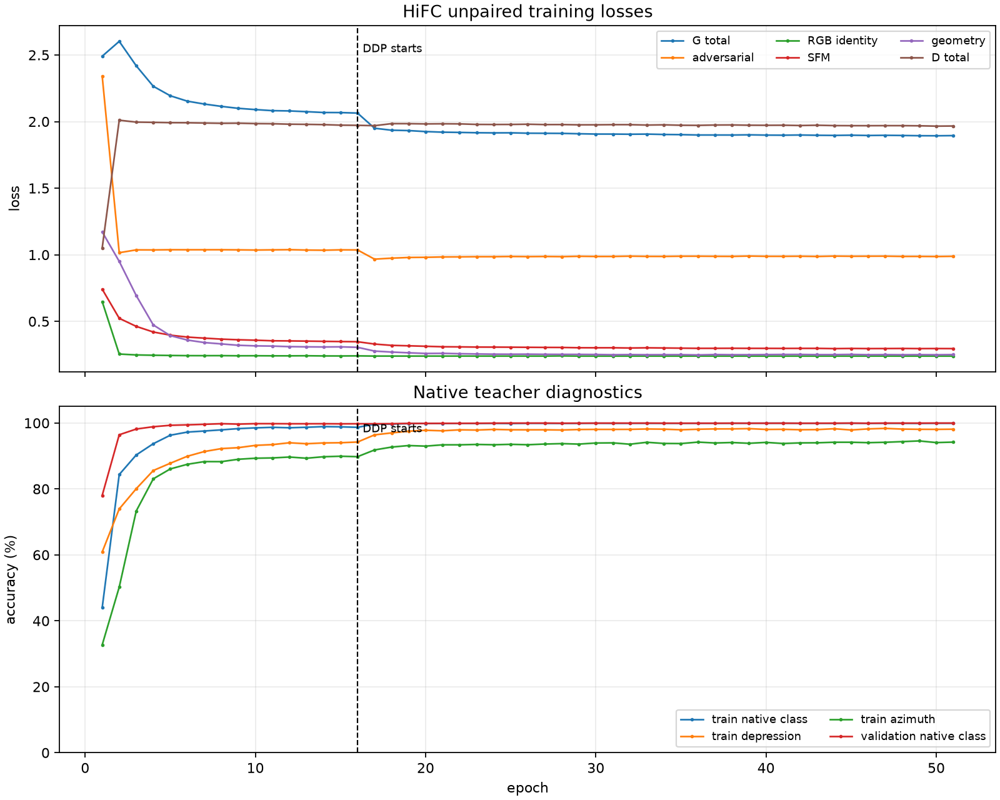
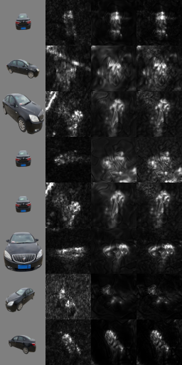
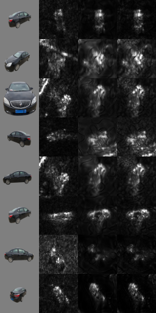
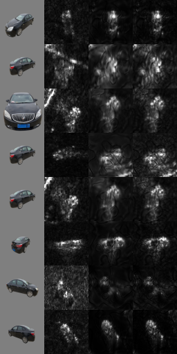
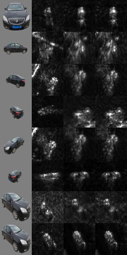

# HiFC Unpaired DDP 训练可视化

本目录记录 `hifc_unpaired_conditioned_v1` 的正式多卡续训。原单卡训练在
epoch 16 完成后，从同一个 `latest.pt` 继续使用 8 卡 DDP；原单卡输出没有被覆盖。

## 当前设置

- GPU：8 x NVIDIA A100
- 每卡 batch：8；全局 batch：64
- 每个 epoch 样本数：24,000
- 训练目标：RGB 与 SAR 只按车型弱匹配，目标方位角、俯视角、波段和极化作为条件
- 不使用 RGB/SAR 像素级配准

## 预览图

每行依次是：输入 RGB、真实 SAR ROI、clean 生成结果、加入观测散斑后的 SAR。

## 指标快照

数值来自训练过程中冻结的 native SAR teacher，仅用于监控，不等同于独立真实 SAR
测试集上的泛化准确率。

| epoch | phase | G total | D total | SFM | geometry | train class | train dep | train az | val class |
|---:|---|---:|---:|---:|---:|---:|---:|---:|---:|
| 16 | single GPU | 2.0637 | 1.9718 | 0.3472 | 0.3054 | 98.68% | 94.22% | 89.78% | 99.76% |
| 46 | 8-GPU DDP | 1.8955 | 1.9690 | 0.2957 | 0.2497 | 99.89% | 98.20% | 94.03% | 99.92% |
| 50 | 8-GPU DDP | 1.8933 | 1.9657 | 0.2960 | 0.2495 | 99.91% | 98.06% | 94.05% | 99.97% |
| 51 | 8-GPU DDP | 1.8946 | 1.9667 | 0.2956 | 0.2508 | 99.91% | 98.11% | 94.19% | 99.97% |

验证损失从 epoch16 到 epoch51：SFM `0.3193 -> 0.2944`，geometry
`0.2645 -> 0.2387`。RGB identity 保持在约 `0.24`，判别器总损失保持在约 `1.97`。

## 文件

- `validation_005_single_gpu.png`、`validation_010_single_gpu.png`、`validation_015_single_gpu.png`：单卡阶段预览
- `validation_020.png`、`validation_030.png`、`validation_040.png`、`validation_045.png`、`validation_050.png`：DDP 阶段预览
- `loss_and_metrics.png`：loss 和 native teacher 诊断曲线，虚线处为 DDP 切换
- `history_single_gpu_epoch001_016.csv`、`history_ddp_epoch017_current.csv`：原始训练记录
- `metrics_snapshot.json`：可复核的指标快照
- `config.json`：DDP 运行配置

训练入口同步在 [`code/train_hifc_unpaired_sar_gan.py`](../../code/train_hifc_unpaired_sar_gan.py)，支持
普通单进程和 `torchrun` 单机多卡启动。
