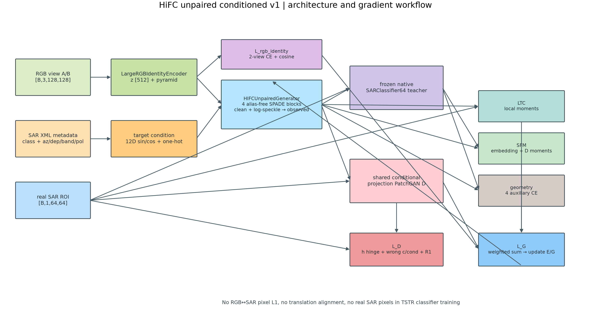
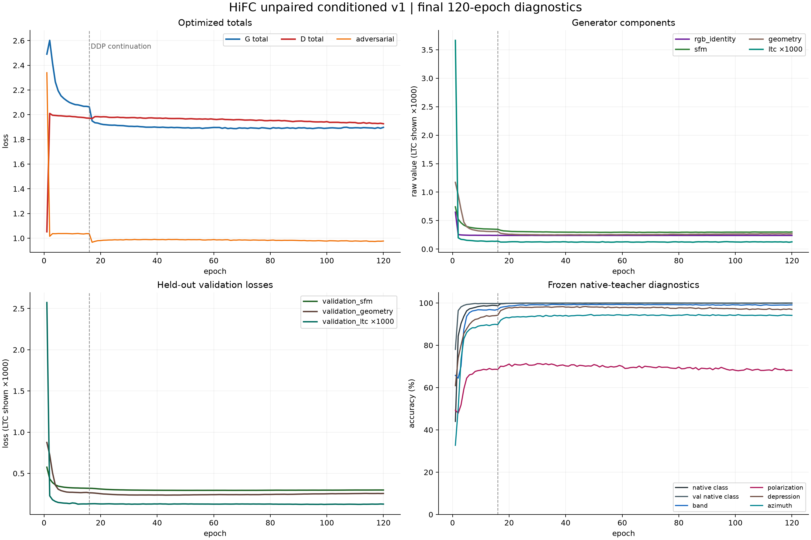
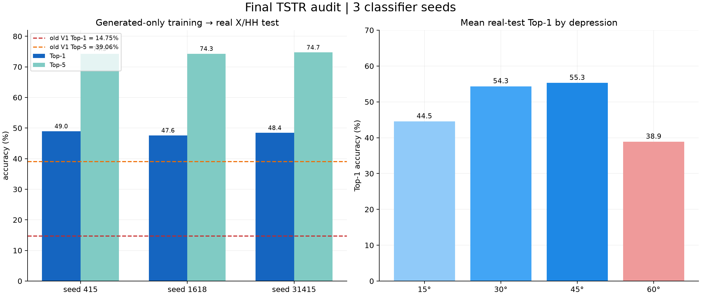

# 最终 HiFC 无像素配对实验可视化

本目录对应 `hifc_unpaired_conditioned_v1` 的最终 120 epoch checkpoint。它把单卡
epoch 1–16 和 8 卡 DDP epoch 17–120 的 history 合并到一个 `history.csv`，并保留
最终 TSTR 的三个独立分类器结果。

## 图表

### 整体流程



`workflow_overview.png` 展示数据输入、RGB encoder、目标条件、单阶段 generator、共享
conditional PatchGAN、frozen native teacher、五个 generator loss、D loss 以及 E/G 更新
之间的关系。图底部标注了本实验的关键边界：没有 RGB↔SAR pixel L1、没有 translation
alignment，TSTR 分类器训练不读取真实 SAR 像素。

### 120 epoch 曲线



四个子图分别是：

1. 加权 `G total`、`D total` 和对抗项；
2. `rgb_identity`、`SFM`、`geometry` 和放大 1000 倍显示的 `LTC`；
3. held-out validation 的三个统计 loss；
4. frozen native teacher 的车型、波段、极化、俯视角和方位角诊断。

虚线是从单卡续接到 DDP 的 epoch 16/17 分界。LTC 原始量级约为 `1e-4`，图中只为可读性
乘以 1000，原始数值在 `history.csv` 中。

### TSTR 结果



左图是三个 classifier seed 的真实 X/HH Top-1/Top-5，虚线是旧 V1 的单次基线；右图
是三个 seed 平均后按 depression 分组的真实测试 Top-1。

| seed | Top-1 | Top-5 |
|---:|---:|---:|
| 415 | 48.95% | 74.26% |
| 1618 | 47.59% | 74.30% |
| 31415 | 48.42% | 74.71% |
| mean | **48.32%** | **74.42%** |

测试集有 5260 张真实 X/HH ROI。三个分类器都只用 final EMA generator 产生的 SAR 训练，
不使用真实 SAR 像素；真实 X/HH 仅作为最终 test。按 depression 的平均 Top-1 为：

```text
15°: 44.53%    30°: 54.32%    45°: 55.27%    60°: 38.86%
```

方位辅助 Top-1 平均为 `60.92%`，circular MAE 平均为 `42.49°`。

## 结果应该如何解读

- 与旧 V1 的约 `14.75%/39.06%` 相比，当前 TSTR 有明确提升，说明生成图里有更多能迁移到真实 X/HH 的车型信息。
- 生成训练集准确率接近 100%，真实测试约 48%，所以 shortcut 和域差异仍没有完全消失。
- native teacher 的生成车型准确率接近 100% 只是内部诊断，不能替代 TSTR。
- 60° 是最弱 depression，不能宣称四个俯视角性能一致。
- `D total` 在 hinge GAN 中不需要单调下降；约 2 附近表示判别器对抗平衡，不是准确率。

## 原始文件

- `history.csv`：epoch 1–16 单卡 + 17–120 DDP 的合并原始记录；
- `config.json`：最终训练参数、条件布局、参数量和 loss 描述；
- `tstr_seed415.json`、`tstr_seed1618.json`、`tstr_seed31415.json`：三个 TSTR 原始 JSON；
- `tstr_summary.json`：均值、seed 标准差、俯视角分组和旧基线；
- `validation_060.png`、`validation_090.png`、`validation_120.png`：训练过程中的最终预览；
- `workflow_overview.png`、`training_curves.png`、`tstr_final_results.png`：本目录生成的图表。

完整的模型、loss、梯度路径、训练命令和限制说明见
[`HIFC_UNPAIRED_FINAL_WORKFLOW_ZH.md`](../../HIFC_UNPAIRED_FINAL_WORKFLOW_ZH.md)。
